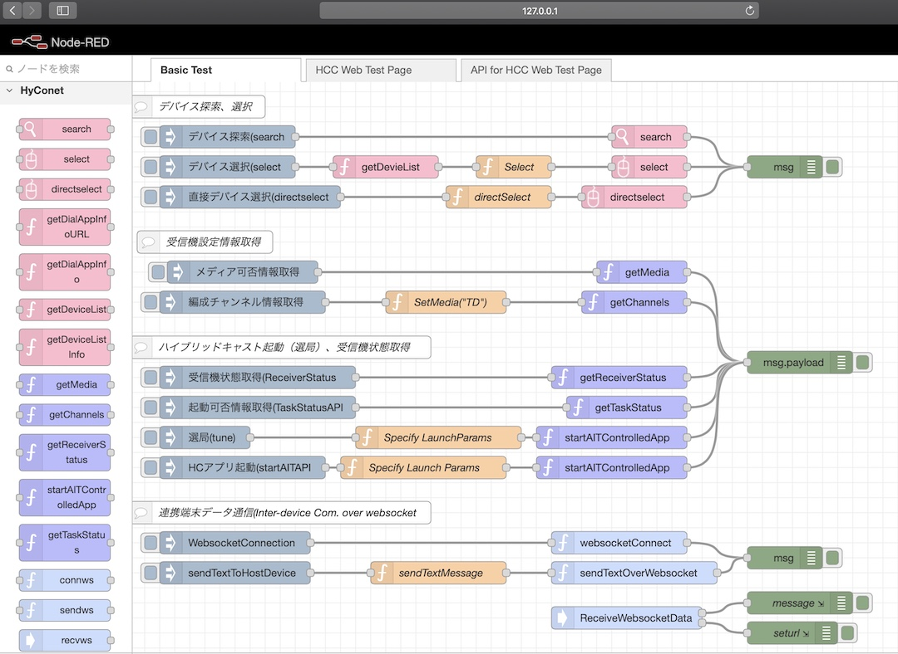

# node-red-contrib-hyconet

Node-RED extra node plugin for hyconet.js(Hybridcast-Connect Javascript SDK)

## Overview

"node-red-contrib-hyconet" is the plugin for "extra nodes" in Node-RED.
The extra nodes represent a set of APIs defined in "hyconet.js" and are available for use in Node-RED dashboard. As for the APIs, see ["hyconet.js" repository](https://github.com/nhkrd/hyconet.js).

"node-red-contrib-hyconet"は、[hyconet.js](https://github.com/nhkrd/hyconet.js)の機能(API)をNode-REDのextra nodeとして利用するためのプラグインです.機能やAPIの詳細は、[hyconet.js](https://github.com/nhkrd/hyconet.js)を参照ください.

## Environment

- nodejs : v10.x
- node-red: v1.0+

## Dependencies

- [hyconet.js](https://github.com/nhkrd/hyconet.js)

## Install with npm

For the installation of extra node package, see the documents of "how to install node-red-plugin" in official page of the node-red below.

- adding extra node [EN](https://nodered.org/docs/user-guide/runtime/adding-nodes)
- extra node for docker [JP](https://nodered.jp/docs/getting-started/docker#%E3%83%AD%E3%83%BC%E3%82%AB%E3%83%AB%E3%83%AA%E3%82%BD%E3%83%BC%E3%82%B9%E3%81%ABdocker%E3%83%95%E3%82%A1%E3%82%A4%E3%83%AB%E3%82%92%E3%82%B3%E3%83%94%E3%83%BC%E3%81%99%E3%82%8B) [EN](https://nodered.org/docs/getting-started/docker#dockerfile-which-copies-in-local-resources)


Install from PALETTE Manager or run the following command in your NODE-RED user directory typically: ~/.node-red.

```bash
## install from github repository
$ npm install git+https://github.com/nhkrd/node-red-contrib-hyconet.git

or
## local install
$ npm install ../node-red-contrib-hyconet
```


## Extra nodes in Node-RED dashboard

This section introduces extra nodes in Node-RED dashboard for the function of hyconet.js that can connect Hybridcast-Connect Emulator [antwapp4hc](https://github.com/nhkrd/antwapp4hc).

Node-RED Dashboard上に追加されるされるhyconet.jsの機能(API)に相当する extra nodeは次の通りです.
ハイブリッドキャストコネクト機能を提供するAndroidTV実装のリファレンスアプリ:[antwapp4hc](https://github.com/nhkrd/antwapp4hc)と接続ができます.




### Samples for WebApp

In [./samples](./samples) Directory, there is flows.json as a sample to use extra nodes.

see [README.md in ./samples](./samples/README.md).


# License

See [LICENSE.txt](./LICENSE.txt).

本ソフトウェアのライセンスについては[LICENSE.txt](./LICENSE.txt)を参照.